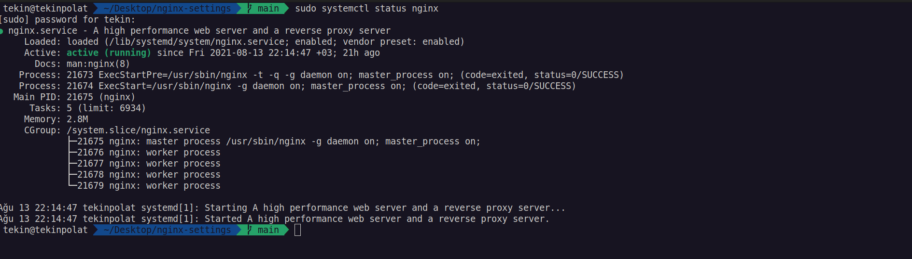

# nginx ayarları

- **listen  80;**                           --> serverin dinlediği port numarası ipv4 (varsayılan: 80)
- **listen  8080;**                         --> serverin dinlediği port numarası ipv4 (8080 portunu kullanıyoruz)
- **listen [::]:80;**                       --> serverin dinlediği port numarası ipv6 (varsayılan: 80)
- **listen 443;**                           --> serverin dinlediği port numarası ipv4 (443 portunu kullanıyoruz)
- **listen [::]:443;**                      --> serverin dinlediği port numarası ipv6 (443 portunu kullanıyoruz)

- **root /var/www/html;**                    --> projenin olduğu dizin
- **root /var/www/html/abc;** 

- **index index.php index.html index.htm**   --> direk domain adı ile girildiğinde açılacak dosya
- **server_name example.com**                --> domain adı

